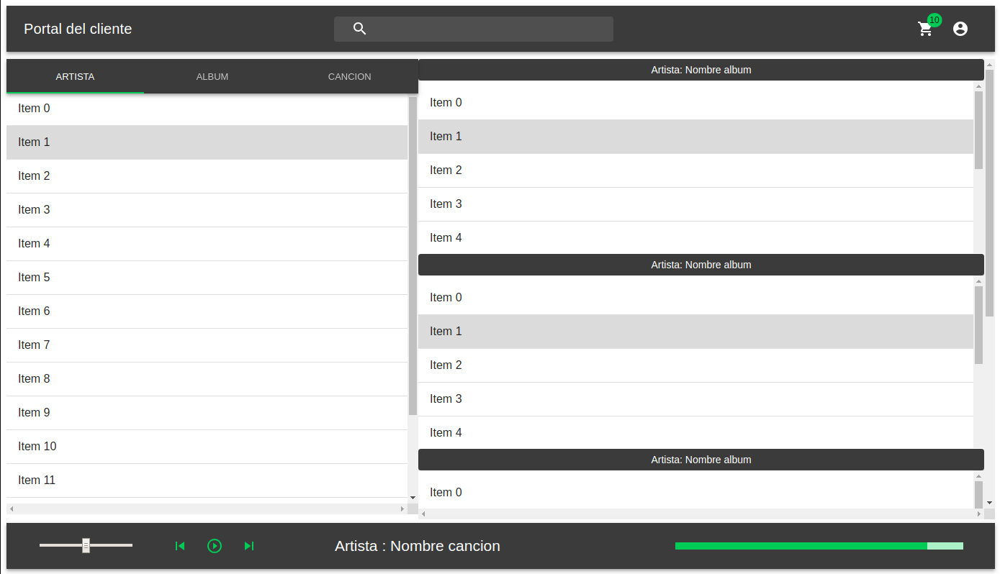

# web-app-poc

Creacion del sitio web POC.

## Descarga del proyecto
Para descargar el proyecto es necesario tener instalado el comando git. 

Linux (basado en Debian):
```
sudo apt install git
```

Windows: descargar la __git bash__ de la pagina https://git-scm.com/.

Se descarga de la siguiente forma:
```
git clone https://github.com/sjukdom/web-app-poc.git
```

## Descarga de node.js

Para que se pueda ejecutar el proyecto se necesita tener instalado:
1. node.js: https://nodejs.org/es/

Los usuarios de Linux (basado en Debian) solo tienen que ejecutar:
```
sudo apt install nodejs
sudo apt install npm
```

## Inicializar el proyecto

Para inicializar el proyecto de node.js e instalar los modulos, se debe 
ejecutar en la terminal ya sea de Linux o de Windows el comando:

```
npm install
```

## Ejecutar el proyecto

Cuando se instalen todos los modulos, ejecutar en terminales distintas 
los comandos:

```
npm run webpack
npm start
```

Abrir el navegador de su preferencia y escribir la direccion: _localhost:3000_

## Sitio web hasta ahora
El sitio web tiene la siguiente interfaz gráfica por el momento:


